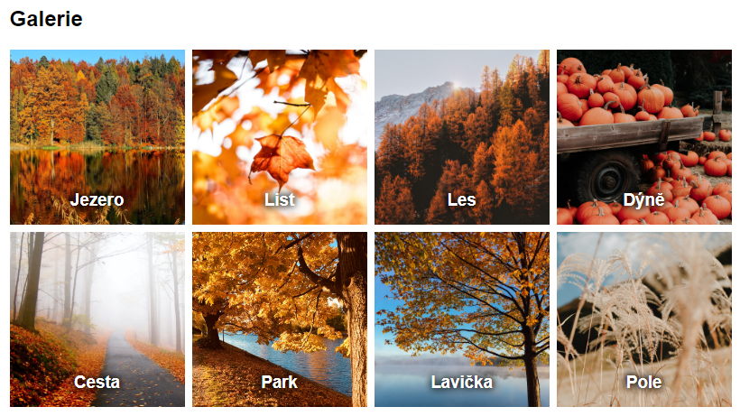
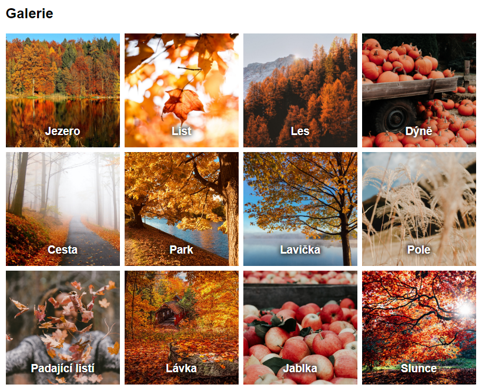
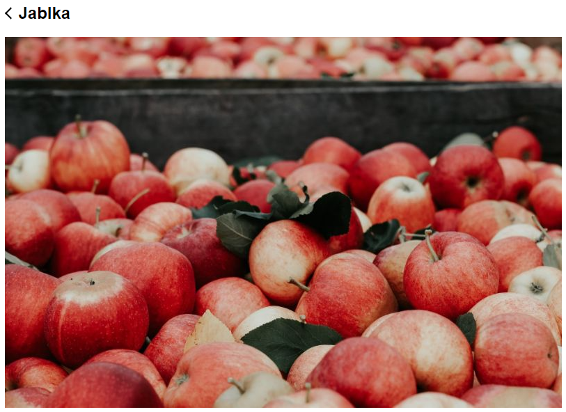

# Cvičení: Eleventy galerie

## Zadání

- Spusť si tento projekt postavený na [Eleventy](https://www.11ty.dev/).

  ### Instalace závislostí

  `npm install`

  ### Produkční sestavení

  `npm run build`

  ### Vývojové sestavení

  `npm run dev`

- Koukni do prohlížeče, že se ti stránka při vývojovém sestavení načte. Měla by ukazovat čtyři obrázky.

- Pomocí smyčky `` vypiš v souboru `galerie.njk` všech osm náhledových obrázků, které jsou popsané v `obrazky.json`.

  

- Přidej do `obrazky.json` další čtyři.

  ```json
  {
  	"popisek": "Padající listí",
  	"soubor": "padajici-listi.jpg",
  	"nahled": {
  		"sirka": 194,
  		"vyska": 194
  	},
  	"original": {
  		"sirka": 800,
  		"vyska": 533
  	}
  },
  {
  	"popisek": "Lávka",
  	"soubor": "lavka.jpg",
  	"nahled": {
  		"sirka": 194,
  		"vyska": 194
  	},
  	"original": {
  		"sirka": 800,
  		"vyska": 533
  	}
  },
  {
  	"popisek": "Jablka",
  	"soubor": "jablka.jpg",
  	"nahled": {
  		"sirka": 194,
  		"vyska": 194
  	},
  	"original": {
  		"sirka": 800,
  		"vyska": 533
  	}
  },
  {
  	"popisek": "Slunce",
  	"soubor": "slunce.jpg",
  	"nahled": {
  		"sirka": 194,
  		"vyska": 194
  	},
  	"original": {
  		"sirka": 800,
  		"vyska": 533
  	}
  }
  ```

- Zkontroluj, že na stránce se vypisuje právě 12 různých obrázků.

  

## Bonus

- Pro každý obrázek udělej stránku s detailem.

  - Z `.galerie__polozka` udělej odkaz `<a>` směřujicí na `/obrazek/{{ obrazek.popisek | slug }}/`.

  - V `detail.njk` vypiš data specifická pro konkrétní obrázek.

  - Zkontroluj, že jednotlivé náhledy v galerii jsou proklikávatelné a na jejich detailech se zobrazují správné obrázky s popiskem.

- Douprav `original.scss` tak, aby se obrázky na detailových stránkách při zmenšení velikosti okna nedeformovaly.

  
